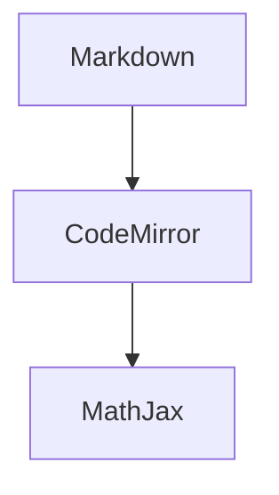

# Heading one

Ordinary Unicode: ä ö ü — Кириллица — 日本語 — 🧪 — $\mathbb{R}$.

**bold**, _italic_, ***both***, ~~strike~~, ==highlight==, `inline $code$`.

%% This comment is saved but hidden in Live Preview. %%

- bullet
  1. nested number
- [ ] todo
- [x] done
- [-] cancelled/custom
- [?] custom

[[Another note]] [[Folder/Note#Heading|Alias]] [[#^fixture-block]]

![[Another note#Heading]]

![[image.png|300x200]]

> [!warning]- Foldable warning
> Markdown **inside**, $x^2$, and [[Another note]].
>
> > [!tip] Nested
> > A nested callout.

| Name | Value | Link |
| :--- | ----: | :---: |
| A | 10 | [[Another note\|Alias]] |

Footnote reference[^fixture] and inline ^[inline footnote].

[^fixture]: A multiline footnote.
    Continued here.

<span style="color:#ed4564" class="fixture">**literal Markdown in HTML**</span>

<kbd>Ctrl</kbd> + <kbd>S</kbd>, H<sub>2</sub>O, x<sup>2</sup>.

<details>
<summary>More</summary>
Raw HTML details.
</details>

```python
print("[[not a link]] and $not math$")
```



Inline math $e^{i\pi}+1=0$ and escaped dollar \$50.

$$
\begin{pmatrix}1&2\\3&4\end{pmatrix}
\qquad \ce{H2O} \qquad \cancel{x} \qquad \bra{\psi}
$$

Let $X \in \R$ and compute $\E[X]$ using `preamble.sty`.

This paragraph is addressable. ^fixture-block

Unknown plugin syntax is retained: `= this.file.name` and <% tp.date.now() %>.
